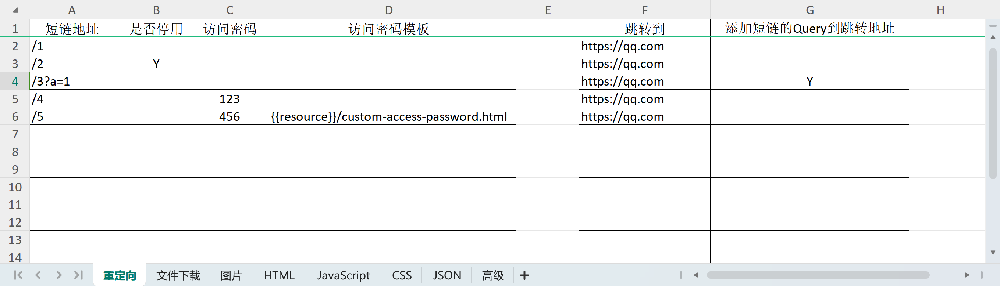

### 短链接系统
#### 下载试用
https://github.com/daa68/ShortURL/releases
#### 特点
- Go语言开发，不需数据库
- 使用Excel文件配置短链接 
  - 可视化管理 
  - 易用性高、灵活性高 
  - 批量处理能力强
  

#### 定价

|       |  免费级  |  基础级  | 企业级  |
|:-----:|:-----:|:-----:|:----:|
|  5年   |  免费   | 1600元 |×  |
|  10年  |  免费   | 2200元 |×  |
|  20年  |  免费   | 3200元 |×  |
| 短链接限量 | 3个|  不限   |  不限   |

*部署服务：300元/次

- 在有效期内，可以使用同级别的后续升级版本。
#### 运维服务
- 及时的版本升级
- 网站状态监测
- 保障网站的正常运行
- 紧急响应服务

|     | 0 ≤ x ≤ 2w | 2w ＜ x ≤ 5w |
  |:---:|:----------:|:-----------:|
| 1年  |   2000元    |    3000元    |
| 5年  |   8800元    |   13200元    |
| 10年 |   12000元   |   18000元    |
| 20年 |   17600元   |   26400元    |

*`x`表示短链接数量
#### 联系我们
- Email: dazhangkeji@163.com
- 微信号：dazhang32

